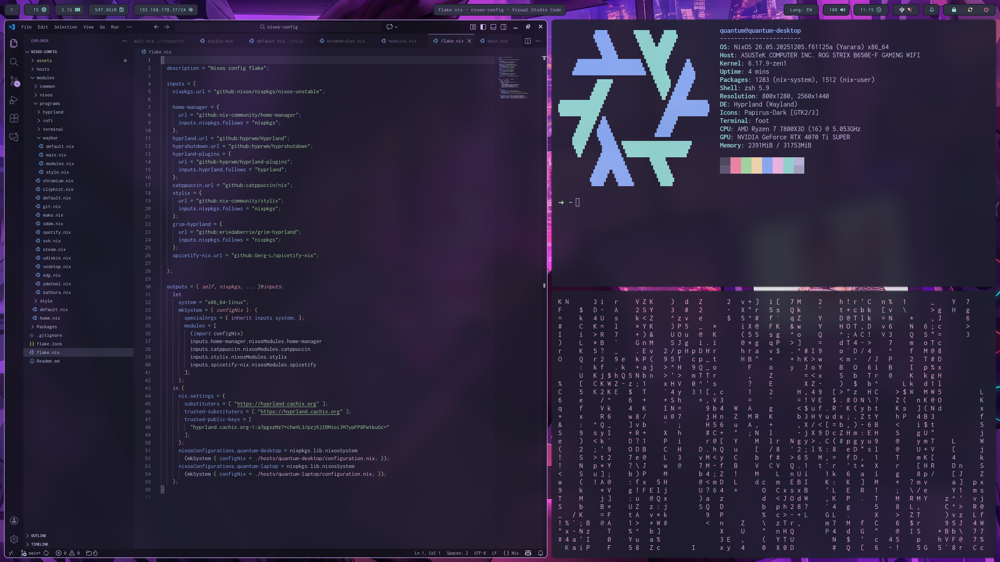
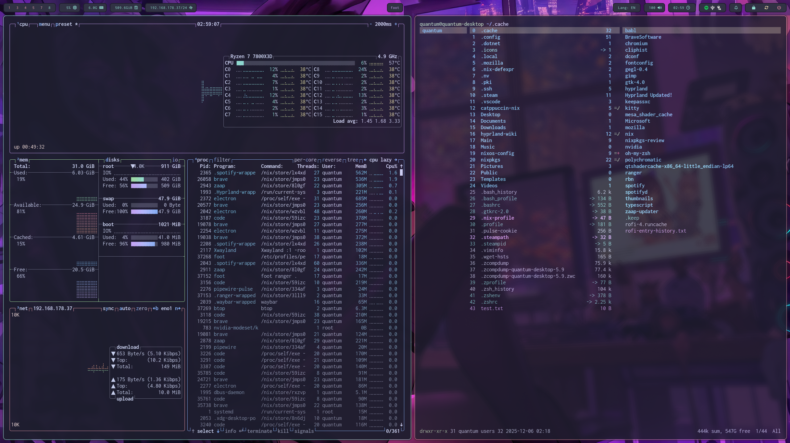
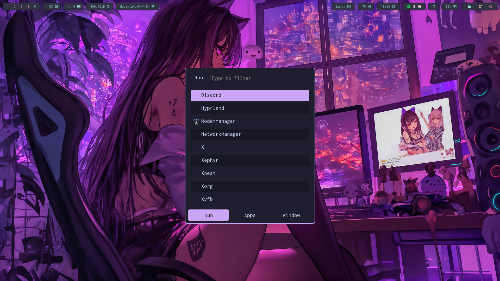
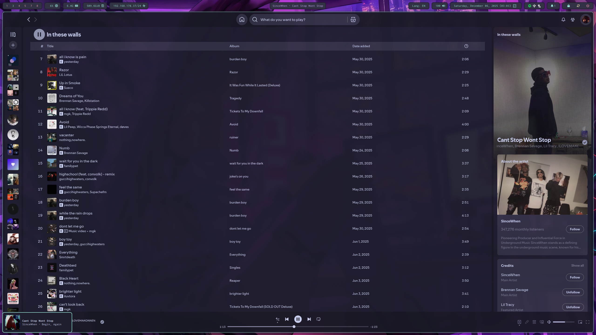

# Nixos Configuration

## Content

- [SDDM](https://github.com/sddm/sddm)
- [Hyprland](https://github.com/hyprwm/Hyprland)
- [Mako](https://github.com/emersion/mako)
- [Waybar](https://github.com/Alexays/Waybar)
- [Rofi](https://github.com/davatorium/rofi)
- [Ranger](https://github.com/ranger/ranger)
- [Btop](https://github.com/aristocratos/btop)

### Ricing

- [Stylix](https://nix-community.github.io/stylix/installation.html)
- [Catppuccin-nix](https://nix.catppuccin.com/)
- [Spicetify-nix](https://gerg-l.github.io/spicetify-nix/)
- [Vesktop Discord Client](https://vesktop.dev/wiki/)

<h3 align="center">
  
 
 <a href="https://catppuccin.com/"> Catppuccin</a>
 
</h3>

## TODO

- finish neovim configuration, handle installation of language servers potentially via nix
    - no imperative installation via neovim plugins
- Implement a module to track the upstream of the catppuccin color palette
- configure potential VMs
- implement [lf](https://github.com/gokcehan/lf)
- implement [Quickshell](https://quickshell.org/)
- dynamically bind characters to F buttons by counting the amount of dofus windows opened 
- make hyprpanel configuration declarative
- migrate to UWSM
- mute discord carr notification - it almost nuked my ears

### Hyprland IPC
- implement keepass workspace closing after popup unlocked the database

## My inspiration

- [woioeow/hyprland-dotfiles](https://github.com/woioeow/hyprland-dotfiles/tree/main)
- [abhinandh-s/catppuccin-nix](https://github.com/abhinandh-s/catppuccin-nix)
- [cricicalart/calos](https://github.com/criticalart/calos) for hyprland window rules
